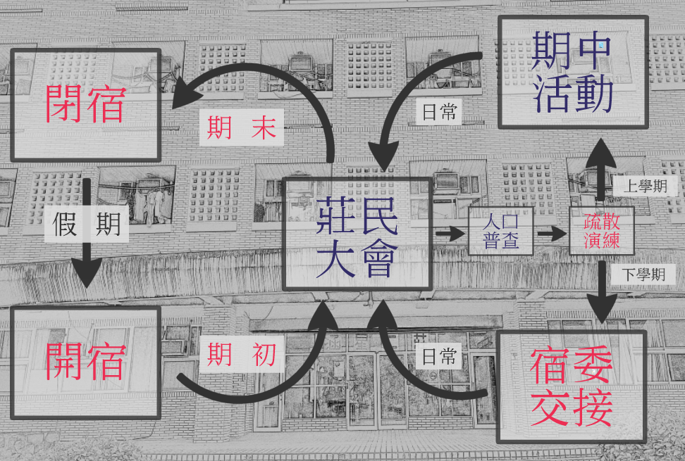
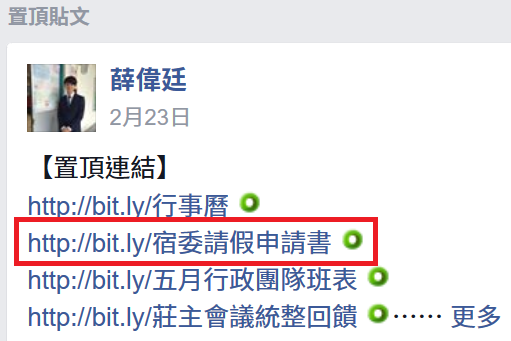
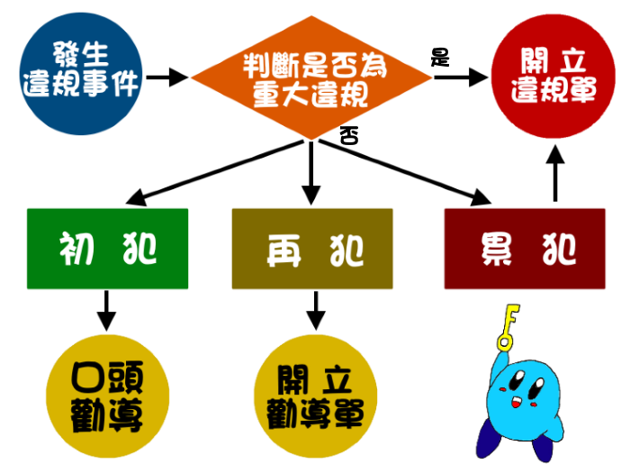

# 年度大小事
<a href="https://goo.gl/TmGjS5" target="new_tab"></img></a>
--
##報告，我要請假
* 
 詢問莊主(副莊)是否同意請假

* 
 下載並填寫 **宿委請假申請書** (如附圖)

* 
 將電子檔寄至考核副主委信箱(dorm.law@gmail.com)

* 
 通過後將 **紙本申請書** 繳交給考核副主委

<a class="fragment" href="https://drive.google.com/file/d/0B-x7We5JmwvfdFF2SGwxbzVRRmM/view" target="new_tab"></img></a>
--
##日常
- <a href="#/1/3" style="color:#0000BB">巡房</a>

- 
冰箱＆簡易廚房清理

- 
常會

- 
抄電錶

- 
<strong>資產清點</strong>

--
##違規處理SOP

--
###日常(各職位)
<table>
	<thead>
		<tr>
			<th>職位</th>
			<th>具體工作</th>
		</tr>
	</thead>
	<tbody>
		<tr>
			<td>副莊</td>
			<td>調查排班</td>
		</tr>
		<tr>
			<td>總務</td>
			<td>經費核銷</td>
		</tr>
		<tr>
			<td>文書</td>
			<td>會議記錄</td>
		</tr>
		<tr>
			<td>活動</td>
			<td>活動企劃 成果報告</td>
		</tr>
		<tr>
			<td>公關</td>
			<td>莊內廣播 常會餐點</td>
		</tr>
		<tr>
			<td>美宣</td>
			<td>文宣製作</td>
		</tr>
		<tr>
			<td>網管</td>
			<td>粉專管理</td>
		</tr>
	</tbody>
</table>
--
##交接
* <a href="https://docs.google.com/spreadsheets/d/19oeyJcD7QVCohJIgqDEUUSJfjaGrECxd2LfNV74f2-U/edit#gid=306989448" target="new_tab"><strong>資產清點表</strong></a>

* 違規表格

* 檢討會記錄