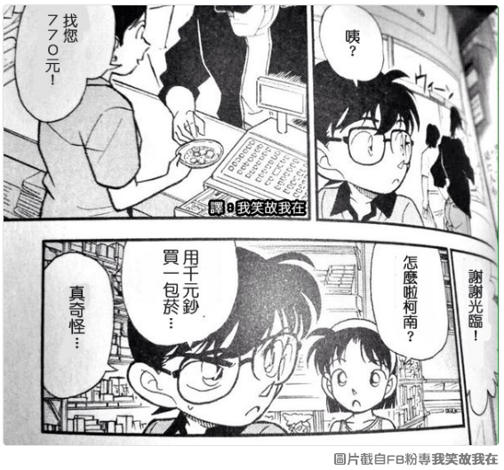
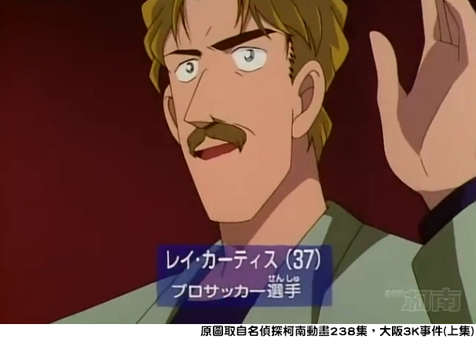
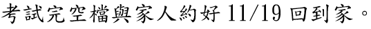
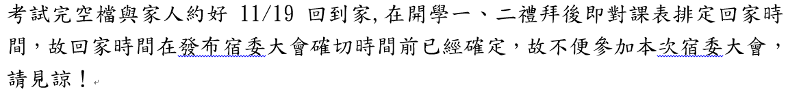

# 最後來談思考
--
# 掌握更多的資訊
--
# 不會怎麼辦？

<strong>能做多好做多好</strong>

--
# 就是要解決問題

<strong>站在解決問題的立場上思考</strong>

--
# 舉三個例子

🚩 關於活動<a href="#/3/5" style="color:#0055FF">發想</a>

🚩 關於面對衝突

🚩 關於各種<a href="#/3/7" style="color:#0055FF">小事</a>

--

--
<a href="#/3/4"></img></a>
--
## 第一次請假就上手

</img>

</img>
